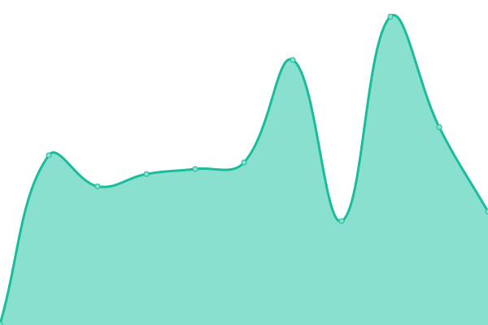

# [📈 Live Status](https://icroptec.github.io/uptime-monitor): <!--live status--> **🟧 Partial outage**

This repository contains the open-source uptime monitor and status page for [iCrop](https://icrop.com.br), powered by [Upptime](https://github.com/upptime/upptime).

With [Upptime](https://upptime.js.org), you can get your own unlimited and free uptime monitor and status page, powered entirely by a GitHub repository. We use [Issues](https://github.com/icroptec/uptime-monitor/issues) as incident reports, [Actions](https://github.com/icroptec/uptime-monitor/actions) as uptime monitors, and [Pages](https://icroptec.github.io/uptime-monitor) for the status page.

<!--start: status pages-->
<!-- This summary is generated by Upptime (https://github.com/upptime/upptime) -->
<!-- Do not edit this manually, your changes will be overwritten -->
<!-- prettier-ignore -->
| URL | Status | History | Response Time | Uptime |
| --- | ------ | ------- | ------------- | ------ |
|  [Vision](http://vision.icrop.online) | 🟥 Down | [vision.yml](https://github.com/icroptec/uptime-monitor/commits/HEAD/history/vision.yml) | 

 0ms
     
 | 

<a href="https://icroptec.github.io/uptime-monitor/history/vision">0.00%</a>
    

|  [Power](https://icroppower.icrop.com.br) | 🟩 Up | [power.yml](https://github.com/icroptec/uptime-monitor/commits/HEAD/history/power.yml) | 

 237ms
     
 | 

<a href="https://icroptec.github.io/uptime-monitor/history/power">100.00%</a>
    

|  [Power Backend](https://icroppower.icrop.com.br/api/v1) | 🟩 Up | [power-backend.yml](https://github.com/icroptec/uptime-monitor/commits/HEAD/history/power-backend.yml) | 

 14ms
     
 | 

<a href="https://icroptec.github.io/uptime-monitor/history/power-backend">100.00%</a>
    

|  [API Python Power](https://icroppower.icrop.com.br/py/api/v1/health) | 🟩 Up | [api-python-power.yml](https://github.com/icroptec/uptime-monitor/commits/HEAD/history/api-python-power.yml) | 

 12ms
     
 | 

<a href="https://icroptec.github.io/uptime-monitor/history/api-python-power">100.00%</a>
    

|  [Icrop Website](https://icrop.com.br) | 🟩 Up | [icrop-website.yml](https://github.com/icroptec/uptime-monitor/commits/HEAD/history/icrop-website.yml) | 

 988ms
     
 | 

<a href="https://icroptec.github.io/uptime-monitor/history/icrop-website">100.00%</a>
    

|  [IOT](https://iot.icrop.com.br) | 🟩 Up | [iot.yml](https://github.com/icroptec/uptime-monitor/commits/HEAD/history/iot.yml) | 

 291ms
     
 | 

<a href="https://icroptec.github.io/uptime-monitor/history/iot">100.00%</a>
    

|  [Mural iCrop](https://mural.icrop.com.br) | 🟩 Up | [mural-i-crop.yml](https://github.com/icroptec/uptime-monitor/commits/HEAD/history/mural-i-crop.yml) | 

 197ms
     
 | 

<a href="https://icroptec.github.io/uptime-monitor/history/mural-i-crop">100.00%</a>
    

|  [Feedz](https://app.feedz.com.br) | 🟩 Up | [feedz.yml](https://github.com/icroptec/uptime-monitor/commits/HEAD/history/feedz.yml) | 

 347ms
     
 | 

<a href="https://icroptec.github.io/uptime-monitor/history/feedz">100.00%</a>
    

<!--end: status pages-->

[**Visit our status website →**](https://icroptec.github.io/uptime-monitor)

## 📄 License

- Powered by: [Upptime](https://github.com/upptime/upptime)
- Code: [MIT](./LICENSE) © [iCrop](https://icrop.com.br)
- Data in the `./history` directory: [Open Database License](https://opendatacommons.org/licenses/odbl/1-0/)
