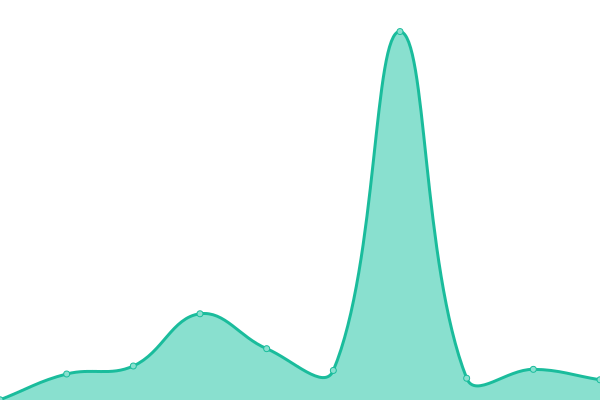

# [📈 Live Status](https://icroptec.github.io/uptime-monitor): <!--live status--> **🟩 All systems operational**

This repository contains the open-source uptime monitor and status page for [iCrop](https://icrop.com.br), powered by [Upptime](https://github.com/upptime/upptime).

With [Upptime](https://upptime.js.org), you can get your own unlimited and free uptime monitor and status page, powered entirely by a GitHub repository. We use [Issues](https://github.com/icroptec/uptime-monitor/issues) as incident reports, [Actions](https://github.com/icroptec/uptime-monitor/actions) as uptime monitors, and [Pages](https://icroptec.github.io/uptime-monitor) for the status page.

<!--start: status pages-->
<!-- This summary is generated by Upptime (https://github.com/upptime/upptime) -->
<!-- Do not edit this manually, your changes will be overwritten -->
<!-- prettier-ignore -->
| URL | Status | History | Response Time | Uptime |
| --- | ------ | ------- | ------------- | ------ |
|  [Vision (vision.icrop.online)](34.49.19.147) | 🟩 Up | [vision-vision-icrop-online.yml](https://github.com/icroptec/uptime-monitor/commits/HEAD/history/vision-vision-icrop-online.yml) | 

 4ms
     
 | 

<a href="https://uptime.icrop.online/history/vision-vision-icrop-online">100.00%</a>
    

|  [iCrop Performance](35.243.207.1) | 🟩 Up | [i-crop-performance.yml](https://github.com/icroptec/uptime-monitor/commits/HEAD/history/i-crop-performance.yml) | 

 28ms
     
 | 

<a href="https://uptime.icrop.online/history/i-crop-performance">100.00%</a>
    

|  [Vision app](https://app23.icrop.online/home) | 🟩 Up | [vision-app.yml](https://github.com/icroptec/uptime-monitor/commits/HEAD/history/vision-app.yml) | 

 221ms
     
 | 

<a href="https://uptime.icrop.online/history/vision-app">100.00%</a>
    

|  [Banco de Dados Vision](https://vision.icrop.online/site-statusmon) | 🟩 Up | [banco-de-dados-vision.yml](https://github.com/icroptec/uptime-monitor/commits/HEAD/history/banco-de-dados-vision.yml) | 

 149ms
     
 | 

<a href="https://uptime.icrop.online/history/banco-de-dados-vision">100.00%</a>
    

|  [Kill](https://kill.icrop.ai) | 🟩 Up | [kill.yml](https://github.com/icroptec/uptime-monitor/commits/HEAD/history/kill.yml) | 

 215ms
     
 | 

<a href="https://uptime.icrop.online/history/kill">100.00%</a>
    

|  [Power](https://icroppower.icrop.com.br) | 🟩 Up | [power.yml](https://github.com/icroptec/uptime-monitor/commits/HEAD/history/power.yml) | 

 317ms
     
 | 

<a href="https://uptime.icrop.online/history/power">100.00%</a>
    

|  [Pivot Design](https://pivotdesign.icrop.online) | 🟩 Up | [pivot-design.yml](https://github.com/icroptec/uptime-monitor/commits/HEAD/history/pivot-design.yml) | 

 247ms
     
 | 

<a href="https://uptime.icrop.online/history/pivot-design">100.00%</a>
    

|  [Mural iCrop](https://mural.icrop.com.br) | 🟩 Up | [mural-i-crop.yml](https://github.com/icroptec/uptime-monitor/commits/HEAD/history/mural-i-crop.yml) | 

 311ms
     
 | 

<a href="https://uptime.icrop.online/history/mural-i-crop">100.00%</a>
    

<!--end: status pages-->

[**Visit our status website →**](https://icroptec.github.io/uptime-monitor)

## 📄 License

- Powered by: [Upptime](https://github.com/upptime/upptime)
- Code: [MIT](./LICENSE) © [iCrop](https://icrop.com.br)
- Data in the `./history` directory: [Open Database License](https://opendatacommons.org/licenses/odbl/1-0/)
