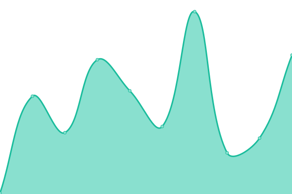
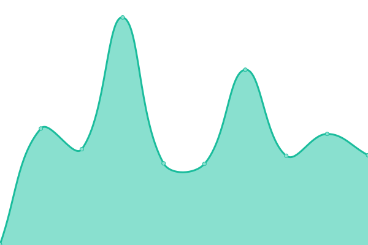

# [📈 Live Status](https://icroptec.github.io/uptime-monitor): <!--live status--> **🟧 Partial outage**

This repository contains the open-source uptime monitor and status page for [iCrop](https://icrop.com.br), powered by [Upptime](https://github.com/upptime/upptime).

With [Upptime](https://upptime.js.org), you can get your own unlimited and free uptime monitor and status page, powered entirely by a GitHub repository. We use [Issues](https://github.com/icroptec/uptime-monitor/issues) as incident reports, [Actions](https://github.com/icroptec/uptime-monitor/actions) as uptime monitors, and [Pages](https://icroptec.github.io/uptime-monitor) for the status page.

<!--start: status pages-->
<!-- This summary is generated by Upptime (https://github.com/upptime/upptime) -->
<!-- Do not edit this manually, your changes will be overwritten -->
<!-- prettier-ignore -->
| URL | Status | History | Response Time | Uptime |
| --- | ------ | ------- | ------------- | ------ |
|  [Vision (vision.icrop.online)](34.49.19.147) | 🟩 Up | [vision-vision-icrop-online.yml](https://github.com/icroptec/uptime-monitor/commits/HEAD/history/vision-vision-icrop-online.yml) | 

 6ms
     
 | 

<a href="https://icroptec.github.io/uptime-monitor/history/vision-vision-icrop-online">100.00%</a>
    

|  [Kill](https://kill.icrop.ai) | 🟩 Up | [kill.yml](https://github.com/icroptec/uptime-monitor/commits/HEAD/history/kill.yml) | 

 183ms
     
 | 

<a href="https://icroptec.github.io/uptime-monitor/history/kill">100.00%</a>
    

|  [Vision app](https://app23.icrop.online/home) | 🟩 Up | [vision-app.yml](https://github.com/icroptec/uptime-monitor/commits/HEAD/history/vision-app.yml) | 

 264ms
     
 | 

<a href="https://icroptec.github.io/uptime-monitor/history/vision-app">99.85%</a>
    

|  [Power](https://icroppower.icrop.com.br) | 🟩 Up | [power.yml](https://github.com/icroptec/uptime-monitor/commits/HEAD/history/power.yml) | 

 351ms
     
 | 

<a href="https://icroptec.github.io/uptime-monitor/history/power">100.00%</a>
    

|  [Icrop Website (icrop.com.br)](https://icrop.com.br) | 🟩 Up | [icrop-website-icrop-com-br.yml](https://github.com/icroptec/uptime-monitor/commits/HEAD/history/icrop-website-icrop-com-br.yml) | 

 1032ms
     
 | 

<a href="https://icroptec.github.io/uptime-monitor/history/icrop-website-icrop-com-br">100.00%</a>
    

|  [Pivot Design](https://pivotdesign.icrop.online) | 🟩 Up | [pivot-design.yml](https://github.com/icroptec/uptime-monitor/commits/HEAD/history/pivot-design.yml) | 

 246ms
     
 | 

<a href="https://icroptec.github.io/uptime-monitor/history/pivot-design">100.00%</a>
    

|  [Automation.icrop.ai](3.82.141.244) | 🟥 Down | [automation-icrop-ai.yml](https://github.com/icroptec/uptime-monitor/commits/HEAD/history/automation-icrop-ai.yml) | 

 0ms
     
 | 

<a href="https://icroptec.github.io/uptime-monitor/history/automation-icrop-ai">0.43%</a>
    

|  [iCrop AgroBI](https://icrop.agrobi.net/) | 🟩 Up | [i-crop-agro-bi.yml](https://github.com/icroptec/uptime-monitor/commits/HEAD/history/i-crop-agro-bi.yml) | 

 1738ms
     
 | 

<a href="https://icroptec.github.io/uptime-monitor/history/i-crop-agro-bi">100.00%</a>
    

|  [Mural iCrop](https://mural.icrop.com.br) | 🟩 Up | [mural-i-crop.yml](https://github.com/icroptec/uptime-monitor/commits/HEAD/history/mural-i-crop.yml) | 

 232ms
     
 | 

<a href="https://icroptec.github.io/uptime-monitor/history/mural-i-crop">100.00%</a>
    

<!--end: status pages-->

[**Visit our status website →**](https://icroptec.github.io/uptime-monitor)

## 📄 License

- Powered by: [Upptime](https://github.com/upptime/upptime)
- Code: [MIT](./LICENSE) © [iCrop](https://icrop.com.br)
- Data in the `./history` directory: [Open Database License](https://opendatacommons.org/licenses/odbl/1-0/)
